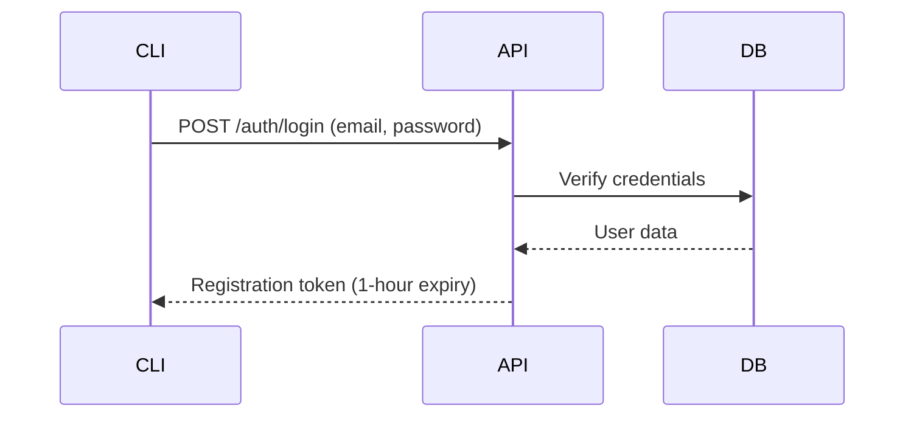
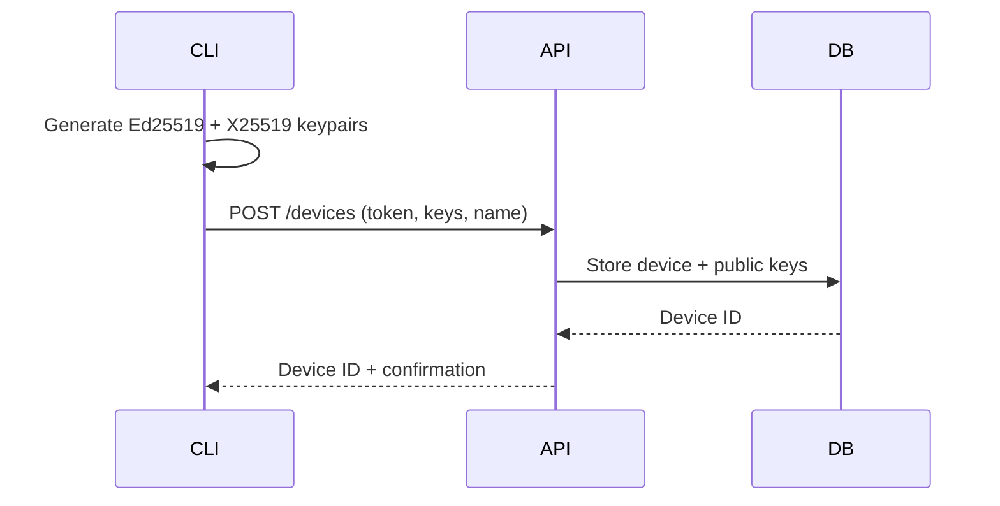
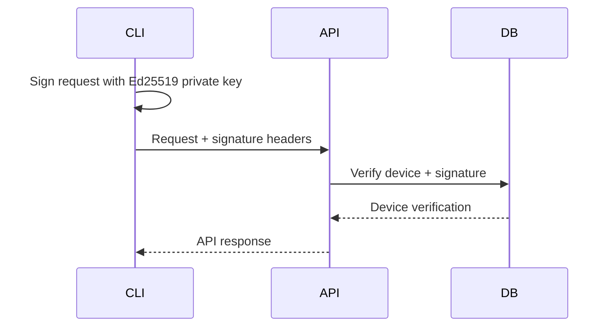

# Initiat API Overview

This document provides a high-level overview of the Initiat API architecture, design principles, and complete endpoint reference.

## Architecture Overview

Initiat implements a **zero-knowledge secret management system** with client-side encryption and device-based authentication. The server never sees plaintext secrets or workspace keys, ensuring maximum security even in the event of server compromise.

### Core Components

1. **Authentication System**: Ed25519 signature-based device authentication
2. **Workspace Management**: Cryptographic key initialization and access control
3. **Secret Management**: Client-side encrypted secret storage and retrieval
4. **Organization Model**: Multi-tenant access control and user management

### Design Principles

- **Zero-Knowledge**: Server never sees plaintext secrets or keys
- **Client-Side Encryption**: All cryptographic operations on client devices
- **Device-Centric**: Each CLI installation is a unique authenticated device
- **Cryptographic Agility**: Designed for future algorithm upgrades
- **Audit Trail**: Complete logging of all operations with device attribution

## API Structure

**Base URL**: `https://api.initiat.com/api/v1`  
**Protocol**: HTTPS only  
**Format**: JSON  
**Authentication**: Ed25519 signatures  
**Encoding**: URL-Safe Base64 (no padding)

### Endpoint Categories

| Category | Endpoints | Authentication | Purpose |
|----------|-----------|----------------|---------|
| **Authentication** | `/auth/*` | None | User login and device registration |
| **Workspaces** | `/workspaces/*` | Device | Workspace access and key management |
| **Secrets** | `/workspaces/*/secrets/*` | Device | Encrypted secret management |
| **Device Approvals** | `/device-approvals/*` | Device | Device approval workflow for workspace access |

## Complete Endpoint Reference

### Authentication Endpoints

#### POST /auth/login
- **Purpose**: Authenticate user with email/password
- **Input**: Email, password
- **Output**: Device registration token
- **Authentication**: None required
- **Documentation**: [API_AUTHENTICATION_SPEC.md](./API_AUTHENTICATION_SPEC.md#post-apiv1authlogin)

#### POST /devices  
- **Purpose**: Register new device for CLI access
- **Input**: Registration token, device name, Ed25519/X25519 public keys
- **Output**: Device ID and confirmation
- **Authentication**: Registration token
- **Documentation**: [API_AUTHENTICATION_SPEC.md](./API_AUTHENTICATION_SPEC.md#post-apiv1devices)

### Workspace Endpoints

#### GET /workspaces
- **Purpose**: List accessible workspaces
- **Input**: None
- **Output**: Array of workspace metadata
- **Authentication**: Device signature required
- **Documentation**: [API_WORKSPACE_SPEC.md](./API_WORKSPACE_SPEC.md#get-workspaces)

#### POST /workspaces/:workspace_id/initialize
- **Purpose**: Initialize workspace cryptographic key
- **Input**: Wrapped workspace key (encrypted with device's X25519 key)
- **Output**: Initialization confirmation
- **Authentication**: Device signature required (workspace owner only)
- **Documentation**: [API_WORKSPACE_SPEC.md](./API_WORKSPACE_SPEC.md#post-workspacesworkspace_idinitialize)

### Secret Management Endpoints

#### GET /workspaces/:workspace_id/secrets
- **Purpose**: List secrets in workspace (metadata only)
- **Input**: None
- **Output**: Array of secret metadata (no encrypted values)
- **Authentication**: Device signature required
- **Documentation**: [API_SECRETS_SPEC.md](./API_SECRETS_SPEC.md#get-workspacesworkspace_idsecrets)

#### GET /workspaces/:workspace_id/secrets/:key
- **Purpose**: Retrieve specific secret with encrypted value
- **Input**: Secret key identifier
- **Output**: Encrypted secret value, nonce, and metadata
- **Authentication**: Device signature required
- **Documentation**: [API_SECRETS_SPEC.md](./API_SECRETS_SPEC.md#get-workspacesworkspace_idsecretskey)

#### POST /workspaces/:workspace_id/secrets
- **Purpose**: Create new secret or update existing (creates new version)
- **Input**: Secret key, encrypted value, nonce
- **Output**: Created/updated secret metadata
- **Authentication**: Device signature required
- **Documentation**: [API_SECRETS_SPEC.md](./API_SECRETS_SPEC.md#post-workspacesworkspace_idsecrets)

#### DELETE /workspaces/:workspace_id/secrets/:key
- **Purpose**: Soft delete secret (preserves audit trail)
- **Input**: Secret key identifier
- **Output**: Empty (204 No Content)
- **Authentication**: Device signature required
- **Documentation**: [API_SECRETS_SPEC.md](./API_SECRETS_SPEC.md#delete-workspacesworkspace_idsecretskey)

### Device Approval Endpoints

The Device Approval API enables workspace administrators to manage device access requests. When a user is invited to a workspace with `requires_device_approval: true`, their devices must be approved by a workspace admin before they can access workspace secrets.

#### GET /device-approvals
- **Purpose**: List all pending device approvals for workspaces where the user is an admin
- **Input**: None
- **Output**: Array of device approval objects with workspace and user details
- **Authentication**: Device signature required (admin user only)
- **Response Format**:
  ```json
  {
    "success": true,
    "data": {
      "device_approvals": [
        {
          "id": 123,
          "status": "pending",
          "inserted_at": "2024-01-15T10:30:00Z",
          "updated_at": "2024-01-15T10:30:00Z",
          "device": {
            "id": 456,
            "name": "John's MacBook",
            "public_key_ed25519": "base64_encoded_key",
            "public_key_x25519": "base64_encoded_key"
          },
          "workspace_membership": {
            "id": 789,
            "role": "member",
            "status": "pending",
            "user": {
              "id": 101,
              "email": "john@example.com",
              "name": "John",
              "surname": "Doe"
            },
            "workspace": {
              "id": 202,
              "name": "Production",
              "slug": "prod",
              "organization": {
                "id": 303,
                "name": "Acme Corp",
                "slug": "acme"
              }
            }
          },
          "approved_by_user": null
        }
      ]
    }
  }
  ```

#### GET /device-approvals/:id
- **Purpose**: Get details of a specific device approval
- **Input**: Device approval ID in URL path
- **Output**: Single device approval object
- **Authentication**: Device signature required (admin user only)
- **Response Format**: Same as individual item in the list above

#### POST /device-approvals/:id/approve
- **Purpose**: Approve a device for workspace access
- **Input**: 
  - `wrapped_workspace_key` (string): The workspace key encrypted with the device's X25519 public key
- **Output**: Updated device approval object
- **Authentication**: Device signature required (workspace admin only)
- **Request Body**:
  ```json
  {
    "wrapped_workspace_key": "base64_encoded_encrypted_workspace_key"
  }
  ```
- **Response Format**:
  ```json
  {
    "success": true,
    "message": "Device approved successfully",
    "data": {
      "device_approval": {
        "id": 123,
        "status": "approved",
        "approved_by_user": {
          "id": 404,
          "email": "admin@example.com",
          "name": "Admin",
          "surname": "User"
        },
        "device": { /* device details */ },
        "workspace_membership": { /* membership details */ }
      }
    }
  }
  ```

#### POST /device-approvals/:id/reject
- **Purpose**: Reject a device for workspace access
- **Input**: None
- **Output**: Updated device approval object
- **Authentication**: Device signature required (workspace admin only)
- **Response Format**:
  ```json
  {
    "success": true,
    "message": "Device rejected successfully",
    "data": {
      "device_approval": {
        "id": 123,
        "status": "rejected",
        "approved_by_user": {
          "id": 404,
          "email": "admin@example.com",
          "name": "Admin",
          "surname": "User"
        },
        "device": { /* device details */ },
        "workspace_membership": { /* membership details */ }
      }
    }
  }
  ```

### Device Approval Workflow

The device approval workflow ensures secure access control for workspace secrets:

1. **User Invitation**: A workspace admin invites a user to join a workspace with `requires_device_approval: true`
2. **Device Registration**: The invited user registers their CLI device(s) using the standard device registration flow
3. **Approval Request**: Each device registration creates a pending device approval record
4. **Admin Review**: Workspace admins can view all pending approvals via `GET /device-approvals`
5. **Approval Decision**: Admins can approve or reject each device:
   - **Approve**: Wraps the existing workspace key with the device's X25519 public key and stores it on the server
   - **Reject**: Denies access and marks the approval as rejected
6. **Access Granted**: Approved devices can now access workspace secrets using their wrapped workspace key

### Security Considerations

- **Permission Model**: Only workspace admins (organization owners or direct workspace admins) can approve/reject devices
- **Workspace Keys**: Each approved device receives the workspace key wrapped with their X25519 public key using ECDH + HKDF + ChaCha20-Poly1305
- **Membership Activation**: User's workspace membership becomes active as soon as any device is approved
- **Audit Trail**: All approval/rejection actions are logged with admin attribution
- **Device Authentication**: All API calls require valid Ed25519 device signatures

### Error Responses

All endpoints return consistent error formats:

```json
{
  "success": false,
  "message": "Error description",
  "errors": ["Detailed error message"]
}
```

Common error scenarios:
- **401 Unauthorized**: Invalid device signature
- **403 Forbidden**: User lacks admin permissions for the workspace
- **404 Not Found**: Device approval not found
- **422 Unprocessable Entity**: Invalid request data or validation errors

## Authentication Flow

### 1. User Registration/Login


### 2. Device Registration


### 3. API Request Authentication


## Cryptographic Architecture

### Key Hierarchy

```
User Account
├── Device 1 (Ed25519 + X25519 keypairs)
├── Device 2 (Ed25519 + X25519 keypairs)
└── Device N (Ed25519 + X25519 keypairs)

Organization
├── Workspace 1
│   ├── Workspace Key (32 bytes, wrapped per device)
│   ├── Secret A (encrypted with workspace key)
│   └── Secret B (encrypted with workspace key)
└── Workspace 2
    ├── Workspace Key (32 bytes, wrapped per device)
    └── Secret C (encrypted with workspace key)
```

### Encryption Algorithms

| Purpose | Algorithm | Key Size | Nonce Size |
|---------|-----------|----------|------------|
| **Request Signing** | Ed25519 | 32 bytes | N/A |
| **Key Exchange** | X25519 | 32 bytes | N/A |
| **Key Wrapping** | XSalsa20-Poly1305 | 32 bytes | 24 bytes |
| **Secret Encryption** | ChaCha20-Poly1305 | 32 bytes | 24 bytes |

### Zero-Knowledge Properties

- **Server never stores**: Plaintext secrets, workspace keys, or private keys
- **Server only stores**: Wrapped keys, encrypted secrets, and public keys
- **Client responsibility**: All encryption, decryption, and key derivation
- **Network security**: All sensitive data encrypted before transmission

## Error Handling

### HTTP Status Codes

| Code | Meaning | Usage |
|------|---------|-------|
| **200** | OK | Successful GET requests |
| **201** | Created | Successful POST requests |
| **204** | No Content | Successful DELETE requests |
| **400** | Bad Request | Invalid request format or encoding |
| **401** | Unauthorized | Authentication failure |
| **403** | Forbidden | Insufficient permissions |
| **404** | Not Found | Resource doesn't exist |
| **422** | Unprocessable Entity | Validation errors |
| **500** | Internal Server Error | Server-side errors |

### Response Format

All API responses follow a consistent format:

#### Success Response Format
```json
{
  "success": true,
  "message": "Optional success message",
  "data": {
    // Response data here
  }
}
```

#### Error Response Format
```json
{
  "success": false,
  "message": "Human-readable error description",
  "errors": ["error message 1", "error message 2"]
}
```

#### Validation Error Format
```json
{
  "success": false,
  "message": "Validation failed",
  "errors": {
    "field_name": ["error message 1", "error message 2"]
  }
}
```

## Rate Limiting

### Limits by Endpoint Category

| Category | Limit | Window | Scope |
|----------|-------|--------|-------|
| **Authentication** | 10 requests | 1 minute | Per IP |
| **Device Registration** | 5 requests | 1 hour | Per user |
| **API Requests** | 1000 requests | 1 hour | Per device |
| **Secret Operations** | 100 requests | 1 minute | Per device |

### Rate Limit Headers

```http
X-RateLimit-Limit: 1000
X-RateLimit-Remaining: 999
X-RateLimit-Reset: 1694616000
```

## SDK and Client Libraries

### Official SDKs

- **Go**: `github.com/initiat/initiat-go` (Primary CLI implementation)

## Versioning and Compatibility

### API Versioning

- **Current Version**: v1
- **Versioning Scheme**: URL-based (`/api/v1/`, `/api/v2/`)
- **Backward Compatibility**: Maintained within major versions
- **Deprecation Policy**: 6-month notice for breaking changes


## Security Considerations

### Transport Security

- **TLS**: TLS 1.3 required for all connections
- **Certificate Pinning**: Recommended for production clients
- **HSTS**: Enabled with long max-age

### Authentication Security

- **Signature Algorithms**: Ed25519 only (no RSA or ECDSA)
- **Timestamp Window**: 5-minute tolerance for clock skew
- **Replay Protection**: Timestamp validation prevents replay attacks

### Data Security

- **Encryption at Rest**: All database fields encrypted
- **Encryption in Transit**: TLS 1.3 for all communications
- **Key Management**: HSM-backed key storage for server keys
