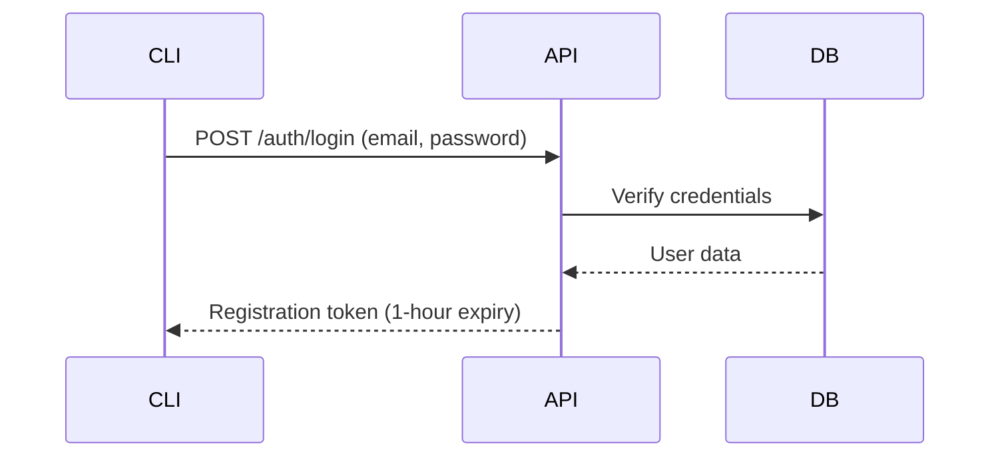
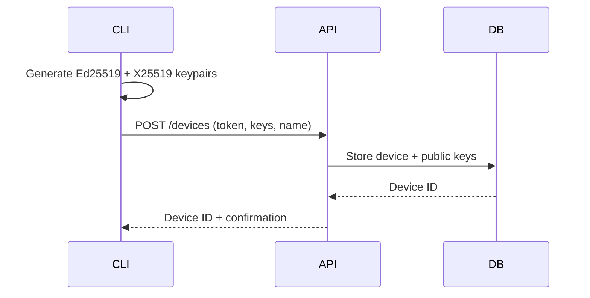
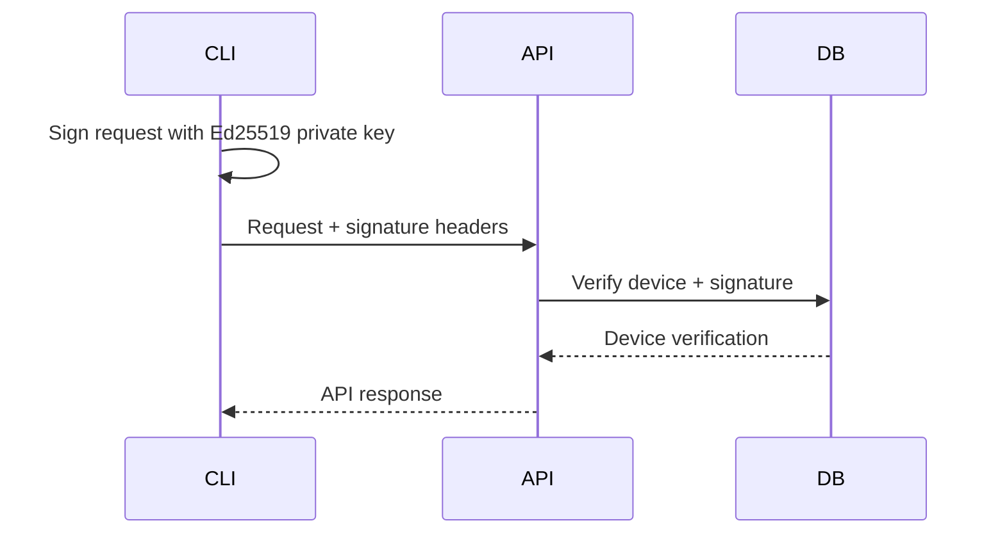

# InitFlow API Overview

This document provides a high-level overview of the InitFlow API architecture, design principles, and complete endpoint reference.

## Architecture Overview

InitFlow implements a **zero-knowledge secret management system** with client-side encryption and device-based authentication. The server never sees plaintext secrets or workspace keys, ensuring maximum security even in the event of server compromise.

### Core Components

1. **Authentication System**: Ed25519 signature-based device authentication
2. **Workspace Management**: Cryptographic key initialization and access control
3. **Secret Management**: Client-side encrypted secret storage and retrieval
4. **Organization Model**: Multi-tenant access control and user management

### Design Principles

- **Zero-Knowledge**: Server never sees plaintext secrets or keys
- **Client-Side Encryption**: All cryptographic operations on client devices
- **Device-Centric**: Each CLI installation is a unique authenticated device
- **Cryptographic Agility**: Designed for future algorithm upgrades
- **Audit Trail**: Complete logging of all operations with device attribution

## API Structure

**Base URL**: `https://api.initflow.com/api/v1`  
**Protocol**: HTTPS only  
**Format**: JSON  
**Authentication**: Ed25519 signatures  
**Encoding**: URL-Safe Base64 (no padding)

### Endpoint Categories

| Category | Endpoints | Authentication | Purpose |
|----------|-----------|----------------|---------|
| **Authentication** | `/auth/*` | None | User login and device registration |
| **Workspaces** | `/workspaces/*` | Device | Workspace access and key management |
| **Secrets** | `/workspaces/*/secrets/*` | Device | Encrypted secret management |

## Complete Endpoint Reference

### Authentication Endpoints

#### POST /auth/login
- **Purpose**: Authenticate user with email/password
- **Input**: Email, password
- **Output**: Device registration token
- **Authentication**: None required
- **Documentation**: [API_AUTHENTICATION_SPEC.md](./API_AUTHENTICATION_SPEC.md#post-apiv1authlogin)

#### POST /devices  
- **Purpose**: Register new device for CLI access
- **Input**: Registration token, device name, Ed25519/X25519 public keys
- **Output**: Device ID and confirmation
- **Authentication**: Registration token
- **Documentation**: [API_AUTHENTICATION_SPEC.md](./API_AUTHENTICATION_SPEC.md#post-apiv1devices)

### Workspace Endpoints

#### GET /workspaces
- **Purpose**: List accessible workspaces
- **Input**: None
- **Output**: Array of workspace metadata
- **Authentication**: Device signature required
- **Documentation**: [API_WORKSPACE_SPEC.md](./API_WORKSPACE_SPEC.md#get-workspaces)

#### POST /workspaces/:workspace_id/initialize
- **Purpose**: Initialize workspace cryptographic key
- **Input**: Wrapped workspace key (encrypted with device's X25519 key)
- **Output**: Initialization confirmation
- **Authentication**: Device signature required (workspace owner only)
- **Documentation**: [API_WORKSPACE_SPEC.md](./API_WORKSPACE_SPEC.md#post-workspacesworkspace_idinitialize)

### Secret Management Endpoints

#### GET /workspaces/:workspace_id/secrets
- **Purpose**: List secrets in workspace (metadata only)
- **Input**: None
- **Output**: Array of secret metadata (no encrypted values)
- **Authentication**: Device signature required
- **Documentation**: [API_SECRETS_SPEC.md](./API_SECRETS_SPEC.md#get-workspacesworkspace_idsecrets)

#### GET /workspaces/:workspace_id/secrets/:key
- **Purpose**: Retrieve specific secret with encrypted value
- **Input**: Secret key identifier
- **Output**: Encrypted secret value, nonce, and metadata
- **Authentication**: Device signature required
- **Documentation**: [API_SECRETS_SPEC.md](./API_SECRETS_SPEC.md#get-workspacesworkspace_idsecretskey)

#### POST /workspaces/:workspace_id/secrets
- **Purpose**: Create new secret or update existing (creates new version)
- **Input**: Secret key, encrypted value, nonce
- **Output**: Created/updated secret metadata
- **Authentication**: Device signature required
- **Documentation**: [API_SECRETS_SPEC.md](./API_SECRETS_SPEC.md#post-workspacesworkspace_idsecrets)

#### DELETE /workspaces/:workspace_id/secrets/:key
- **Purpose**: Soft delete secret (preserves audit trail)
- **Input**: Secret key identifier
- **Output**: Empty (204 No Content)
- **Authentication**: Device signature required
- **Documentation**: [API_SECRETS_SPEC.md](./API_SECRETS_SPEC.md#delete-workspacesworkspace_idsecretskey)

## Authentication Flow

### 1. User Registration/Login


### 2. Device Registration


### 3. API Request Authentication


## Cryptographic Architecture

### Key Hierarchy

```
User Account
├── Device 1 (Ed25519 + X25519 keypairs)
├── Device 2 (Ed25519 + X25519 keypairs)
└── Device N (Ed25519 + X25519 keypairs)

Organization
├── Workspace 1
│   ├── Workspace Key (32 bytes, wrapped per device)
│   ├── Secret A (encrypted with workspace key)
│   └── Secret B (encrypted with workspace key)
└── Workspace 2
    ├── Workspace Key (32 bytes, wrapped per device)
    └── Secret C (encrypted with workspace key)
```

### Encryption Algorithms

| Purpose | Algorithm | Key Size | Nonce Size |
|---------|-----------|----------|------------|
| **Request Signing** | Ed25519 | 32 bytes | N/A |
| **Key Exchange** | X25519 | 32 bytes | N/A |
| **Key Wrapping** | XSalsa20-Poly1305 | 32 bytes | 24 bytes |
| **Secret Encryption** | ChaCha20-Poly1305 | 32 bytes | 24 bytes |

### Zero-Knowledge Properties

- **Server never stores**: Plaintext secrets, workspace keys, or private keys
- **Server only stores**: Wrapped keys, encrypted secrets, and public keys
- **Client responsibility**: All encryption, decryption, and key derivation
- **Network security**: All sensitive data encrypted before transmission

## Error Handling

### HTTP Status Codes

| Code | Meaning | Usage |
|------|---------|-------|
| **200** | OK | Successful GET requests |
| **201** | Created | Successful POST requests |
| **204** | No Content | Successful DELETE requests |
| **400** | Bad Request | Invalid request format or encoding |
| **401** | Unauthorized | Authentication failure |
| **403** | Forbidden | Insufficient permissions |
| **404** | Not Found | Resource doesn't exist |
| **422** | Unprocessable Entity | Validation errors |
| **500** | Internal Server Error | Server-side errors |

### Error Response Format

```json
{
  "error": {
    "message": "Human-readable error description"
  }
}
```

### Validation Error Format

```json
{
  "success": false,
  "error": "Validation failed",
  "errors": {
    "field_name": ["error message 1", "error message 2"]
  }
}
```

## Rate Limiting

### Limits by Endpoint Category

| Category | Limit | Window | Scope |
|----------|-------|--------|-------|
| **Authentication** | 10 requests | 1 minute | Per IP |
| **Device Registration** | 5 requests | 1 hour | Per user |
| **API Requests** | 1000 requests | 1 hour | Per device |
| **Secret Operations** | 100 requests | 1 minute | Per device |

### Rate Limit Headers

```http
X-RateLimit-Limit: 1000
X-RateLimit-Remaining: 999
X-RateLimit-Reset: 1694616000
```

## SDK and Client Libraries

### Official SDKs

- **Go**: `github.com/initflow/initflow-go` (Primary CLI implementation)
- **JavaScript/TypeScript**: `@initflow/sdk` (Browser and Node.js)
- **Python**: `initflow-python` (Planned)

### Community SDKs

- **Rust**: Community-maintained
- **Java**: Community-maintained

## Versioning and Compatibility

### API Versioning

- **Current Version**: v1
- **Versioning Scheme**: URL-based (`/api/v1/`, `/api/v2/`)
- **Backward Compatibility**: Maintained within major versions
- **Deprecation Policy**: 6-month notice for breaking changes

### Client Compatibility

- **Minimum CLI Version**: v1.0.0
- **Recommended Update**: Latest stable release
- **Breaking Changes**: Communicated via changelog and migration guides

## Security Considerations

### Transport Security

- **TLS**: TLS 1.3 required for all connections
- **Certificate Pinning**: Recommended for production clients
- **HSTS**: Enabled with long max-age

### Authentication Security

- **Signature Algorithms**: Ed25519 only (no RSA or ECDSA)
- **Timestamp Window**: 5-minute tolerance for clock skew
- **Replay Protection**: Timestamp validation prevents replay attacks

### Data Security

- **Encryption at Rest**: All database fields encrypted
- **Encryption in Transit**: TLS 1.3 for all communications
- **Key Management**: HSM-backed key storage for server keys

### Compliance

- **SOC 2 Type II**: Annual certification
- **GDPR**: Full compliance with data protection regulations
- **CCPA**: California Consumer Privacy Act compliance
- **HIPAA**: Available for healthcare customers

## Monitoring and Observability

### Metrics

- **Request Latency**: P50, P95, P99 response times
- **Error Rates**: 4xx and 5xx error percentages
- **Authentication Success**: Device authentication success rates
- **Throughput**: Requests per second by endpoint

### Logging

- **Access Logs**: All API requests with device attribution
- **Error Logs**: Detailed error information for debugging
- **Audit Logs**: Security-relevant events and changes
- **Performance Logs**: Slow query and operation tracking

### Alerting

- **Error Rate Spikes**: >5% error rate for 5 minutes
- **Latency Degradation**: P95 >500ms for 5 minutes
- **Authentication Failures**: >10% failure rate for 5 minutes
- **Security Events**: Suspicious access patterns

## Development and Testing

### Development Environment

- **Base URL**: `https://api-dev.initflow.com/api/v1`
- **Rate Limits**: Relaxed for development
- **Test Data**: Sandbox workspaces and secrets available

### Testing Tools

- **Postman Collection**: Complete API collection with examples
- **CLI Test Suite**: Automated integration tests
- **Load Testing**: Performance benchmarks and stress tests

### Documentation

- **OpenAPI Spec**: Machine-readable API specification
- **Interactive Docs**: Swagger UI for API exploration
- **Code Examples**: Complete examples in multiple languages
- **Migration Guides**: Version upgrade instructions

## Support and Resources

### Documentation

- **API Reference**: Complete endpoint documentation
- **CLI Guide**: Command-line interface documentation
- **Integration Guide**: Step-by-step integration instructions
- **Best Practices**: Security and performance recommendations

### Support Channels

- **GitHub Issues**: Bug reports and feature requests
- **Community Forum**: Developer discussions and Q&A
- **Email Support**: Direct support for enterprise customers
- **Slack Community**: Real-time developer chat

### Status and Updates

- **Status Page**: Real-time API status and incident reports
- **Changelog**: Detailed release notes and updates
- **Security Advisories**: Security updates and patches
- **Roadmap**: Planned features and improvements
